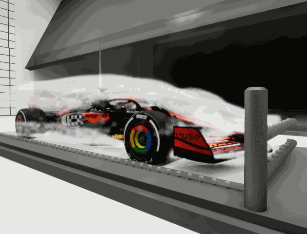
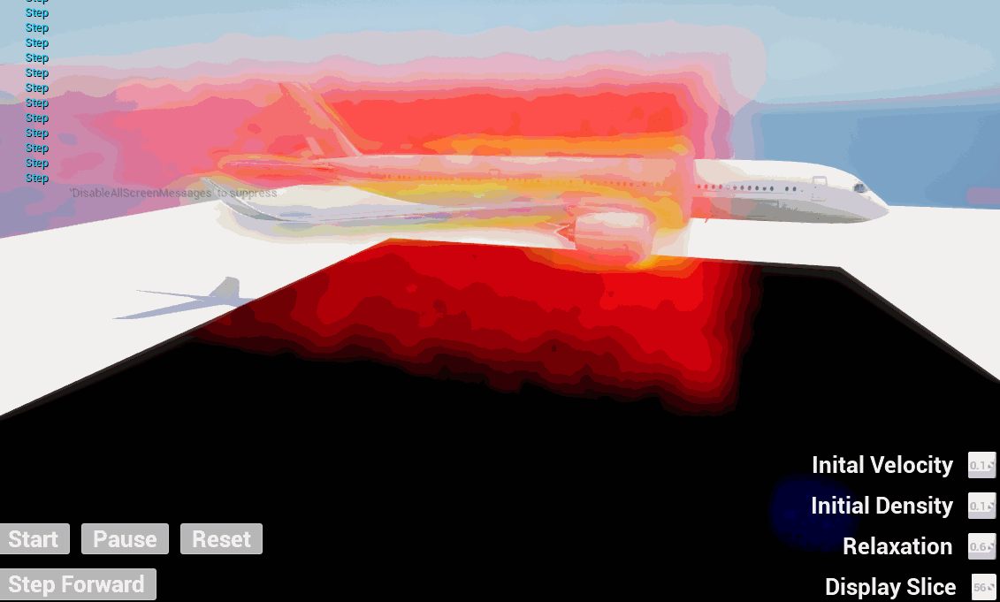
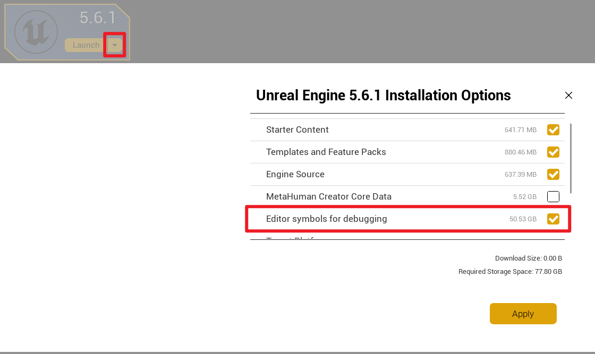
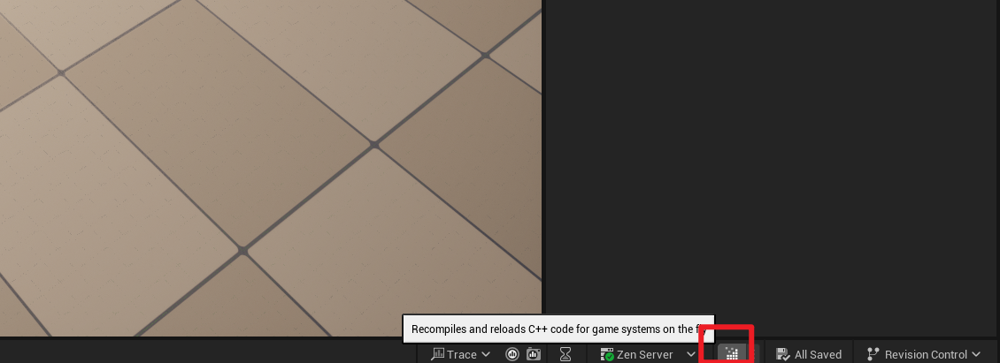
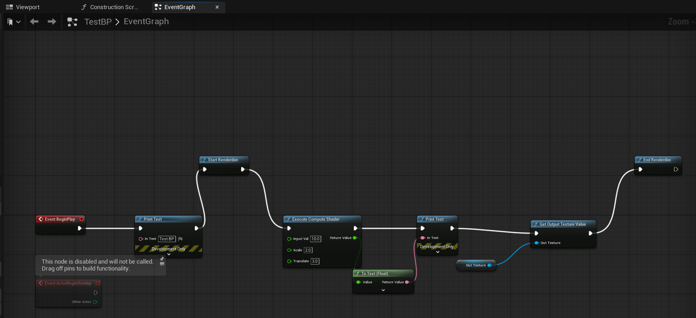
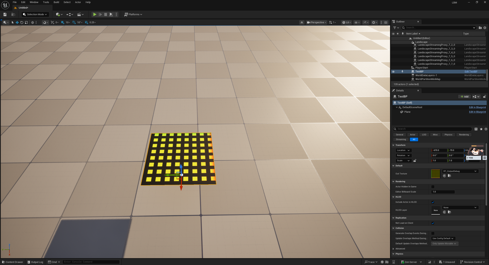

# Introduction

RealiFluid is an interactive, realtime LBM based fluid simulation implemented in Unreal Engine Plugin. Its goal is to provide **high-speed** and **high-resolution** fluid simulation, as well as maintaining level of accuracy. 

3D LBM aerodynamics simulation on a 256\*256\*256 grid

## LBM: Core of simulation algorithm

Real-time fluid simulation focuses on how velocity and pressure fields evolve frame by frame. Classical CFD solves the Navier–Stokes equations directly at the macroscopic scale, whereas the lattice Boltzmann method (LBM) operates at a mesoscopic scale: each lattice node stores several particle distribution functions aligned with discrete velocity directions. Each time step alternates between **collision** (relax the distributions toward equilibrium locally) and **streaming** (advect the distributions along their discrete velocities to neighboring nodes). Those distributions are then used to reconstruct density and velocity. Because every lattice cell performs identical local work, **LBM scales perfectly on GPUs** and naturally handles complex boundaries—exactly what this high-resolution real-time project needs.

- **Laminar flow** – smooth, ordered motion where fluid parcels slide past one another along predictable trajectories; typical of low-speed or high-viscosity regimes.
- **Turbulent flow** – chaotic, vortex-dominated motion with energy cascading across many scales; it raises numerical stability and resolution requirements.
- **Reynolds number (Re)** – Re = ρUL / μ, relating inertial to viscous forces. Low Re usually stays laminar; passing a critical Re triggers turbulence. By tuning LBM relaxation parameters, grid spacing, and boundary conditions, we can emulate a wide range of Re-driven behaviors.

Low-Re scenarios (e.g., slow channel flow) remain stable with moderate grids. High-Re cases demand finer lattices, smaller time steps, or advanced collision schemes (MRT, entropic LBM, etc.) to preserve accuracy and robustness.

See links below to know more about LBM:

https://www.youtube.com/watch?v=jfk4feD7rFQ

https://www.youtube.com/watch?v=8qorVDJS1QA

https://ppluscht.github.io/LBM/

https://pastewka.github.io/Accelerators/lecture/boundary-conditions.html

## Moment Based Representation

HOME-LBM is a high-performance moment-based Lattice Boltzmann Method (LBM) solver designed for real-time and large-scale fluid simulation. It is built with a strong focus on GPU acceleration, numerical stability, and boundary robustness.

This implementation features:

- Moment-based collision and reconstruction
- Efficient GPU compute pipeline
- Support for multiple boundary conditions (solid, free-slip, outflow, etc.)
- Designed for real-time graphics and interactive simulation

HOME-LBM is suitable for:

- Real-time fluid simulation
- Research on GPU-based LBM
- Physics-based visual effects

The project aims to balance physical accuracy, performance, and engineering practicality.

## Boundary Conditions & Mesh Voxelization

HOME-LBM provides dedicated implementations for both free-slip and no-slip boundary conditions under the moment-based LBM framework. The boundary treatment is performed directly in moment space, ensuring improved numerical stability and accurate control of wall behavior.

**No-slip boundary** enforces zero velocity at solid surfaces, suitable for viscous flow and closed solid containers.

**Free-slip boundary** preserves tangential velocity while reflecting normal components, enabling stable simulation of inviscid or open surfaces.

For complex geometries, HOME-LBM supports mesh-based voxelization to convert arbitrary triangle meshes into grid-aligned solid boundary fields. The voxelized result is seamlessly integrated into the boundary handling stage of the solver, allowing accurate fluid–solid interaction on detailed models.

This design enables stable and efficient simulation of fluids interacting with both simple and highly complex solid boundaries.

# Work In Progress

- Two phase Flow
- Multi-Dimensional Simulation
- Fluid & Gas Realistic Rendering

# Project Documents

[Milestone 1 Slides](https://docs.google.com/presentation/d/1kCbG1b0JJE_pyrgcBuqKFJYQE60t1BLb7Cjyb2nZFx8/edit?usp=sharing)

# Reference Papers

Target Paper to implement:

[Haoxiang Wang, Kui Wu, Hui Qiao, Mathieu Desbrun, and Wei Li. 2025. Kinetic Free-Surface Flows and Foams with Sharp Interfaces. ACM Trans. Graph.](https://haoxiang-wang.com/assets/WWQD25.pdf)

Additional References:

**Memory Compression**

- Technical report: How to implement your DdQq dynamics with only q variables per node (instead of 2q)

**Moment-Based Representation**

- A graphic processing unit implementation for the moment representation of the lattice Boltzmann method
- High-Order Moment-Encoded Kinetic Simulation of Turbulent Flows

**Two-Phase(Free Surface) LBM**

- Physically based Animation of Free Surface Flows with the Lattice Boltzmann Method
- High Performance Free Surface LBM on GPUs

# Project Setup(For Developers)

1. Install your Unreal Engine, either epic launcher version or source code version. I will use epic launcher version. For the source code version, please follow the documentation on epic website. 

2. If you install epic launcher version, I highly recommend you to install the debug symbol files as well since it will provide more information for debugging.

3. When you finish install unreal engine, right click file LBM.uproject, then click `Generate Visual Studio project files`. Then use LBM.sln vs solution file to compile and debug the UE project.

4. Before you run the project, check the file `./Config/DefaultEngine.ini` in the project folder. You should change the setting `renderdoc.BinaryPath` to your install location of renderdoc. **Note: Don't use backslash`\` in path, please use slash`/`** If you compile your renderdoc from source, you should set the directory to the folder contains renderdoc.dll

5. Also, check your `Engine/UE5/Config/ConsoleVariables.ini` in vs solution explorer. You may want to use `r.ShaderDevelopmentMode=1` and `r.DumpShaderDebugInfo=1`.

6. For addtional info for debugging shaders, you may find addtional generated files in `Saved\ShaderDebugInfo\PCD3D_SM6\Global` in your project folder as you finish compile your shaders. `Global` folder contains global shaders and compute shaders, rest of the folders are material shaders. 

# Running the Project

1. The way I recommend to debug project is to run through `Local Windows Debugger` big button so that you can capture logs and add breakpoints. 

2. Once you start your UE editor, you can use hot reload button to recompile code changes by hitting the button. You can also set your hotkey in Editor Preference.

3. To test the compute shader code, open `TestBP` blueprint in content drawer, and switch to event graph. If you want to debug the shader using renderdoc, you can put your functions between `Start Renderdoc` and `End Renderdoc`. After executing `End Renderdoc`, `Captures.rdc` will appear at the project folder for you to inspect. Do not use the renderdoc blueprint functions in `Event Tick` since it will continously capture the resource at every frame. 

4. Go to viewport and drag TestBP from content drawer to scene. And hit start. After a few seconds for renderdoc finish its work, you will see a texture on the plane. This demonstrates how to use unreal engine to write a compute shader with texture input and output. 

5. For the global shader creation, please see my blog [Link](https://sirenri2001.github.io/2025-02-05-unreal-shader-tutorial-(Chinese)/). Also check Reference folder for additional papers for LBM implementation.

# Q&A 

1. Q:Why my debug key input does not work?

A: After dropping your blueprint actor to scene, select that then see the property window, select Misc tab, replace `Disable Input` to `Player 0`
